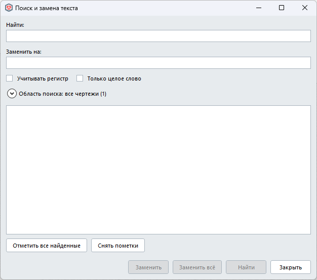

# Поиск и замена текста для Renga

Плагин для [Renga](https://rengabim.com) в духе диалога «Найти и заменить» из Word: ищет и заменяет текст в текстовых блоках на чертежах проекта.

## Возможности
- Поля «Найти» и «Заменить на», опции «Учитывать регистр» и «Только целое слово».
- Область поиска: все чертежи или только выбранные разделы и чертежи.
- Список найденных блоков с подсветкой совпадения; замена в отмеченных блоках или во всех сразу.
- Вся замена — одна операция Renga: отменяется одним Ctrl+Z.

## Ограничения
- Ищет только в текстовых блоках на чертежах. Текстовые выноски и текст в 3D-модели не поддерживаются.
- Поиск идёт строго внутри одного фрагмента текста с одинаковым форматированием: фраза, часть которой набрана другим шрифтом или стилем, не находится.

## Требования
- Windows, Renga с поддержкой плагинов .NET 8 (в манифесте указан API 2.49).

## Установка
1. Скачайте архив `TextSearchReplace-0.1.zip` на странице [Releases](../../releases).
2. Закройте Renga.
3. Распакуйте архив и скопируйте папку `TextSearchReplace` в `C:\Program Files\Renga Professional\Plugins\` (потребуется подтверждение администратора).
4. Запустите Renga: на ленте появится кнопка «Поиск и замена текста».

Если кнопки нет, проверьте журнал `%localappdata%\Renga Software\Renga\AecApp.log`.

## Удаление
Закройте Renga и удалите папку `Plugins\TextSearchReplace`.

## Лицензия
Все права защищены, см. [LICENSE](LICENSE). Исходный код не публикуется. Сторонние компоненты: Renga.WPF.Styles (MIT), сборки Renga SDK.